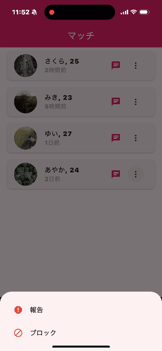

# マッチングアプリ (Matching App)

Flutter製のモダンなマッチングアプリケーションです。TinderライクなUIとスワイプ機能を持つ、クロスプラットフォーム対応のアプリです。
 // Start Generation Here


## 🚀 機能一覧

### 📱 主要画面
- **ホーム画面** - カードスワイプでユーザー評価
- **プロフィール画面** - 写真管理・基本情報編集
- **マッチ画面** - マッチした相手の一覧表示
- **チャット画面** - リアルタイムメッセージ機能
- **設定画面** - 各種設定とアカウント管理

### 🎯 主要機能

#### 🏠 ホーム画面
- **スワイプ機能** - 左（パス）、右（いいね）、上（スーパーいいね）
- **ユーザーカード表示** - 写真、年齢、距離、基本情報
- **フローティングアクションボタン** - 手動での評価操作

#### 👤 プロフィール画面
- **写真管理** - 複数枚の写真アップロード・削除
- **基本情報編集** - 名前、年齢、自己紹介文
- **興味・趣味設定** - タグ形式での興味分野選択
- **プロフィール保存** - 変更内容の保存機能

#### 💕 マッチ画面
- **マッチリスト** - マッチした相手の一覧
- **マッチ詳細** - 相手のプロフィール確認
- **チャット開始** - マッチした相手とのメッセージ
- **ブロック・報告機能** - 安全性を保つための機能

#### 💬 チャット画面
- **チャットルーム一覧** - 全ての会話履歴
- **未読メッセージ表示** - 未読件数の表示
- **メッセージ送信** - リアルタイムメッセージング
- **メッセージ履歴** - 過去のメッセージ表示

#### ⚙️ 設定画面
- **通知設定** - プッシュ通知の制御
- **位置情報設定** - 検索範囲の設定
- **年齢範囲設定** - 表示する年齢の範囲指定
- **アカウント管理** - プロフィール編集・削除
- **プライバシー設定** - セキュリティとプライバシー
- **サポート機能** - ヘルプ・お問い合わせ

## 🛠️ 技術スタック

### フレームワーク・ライブラリ
- **Flutter** - UI フレームワーク
- **Dart** - プログラミング言語

### 状態管理・ナビゲーション
- **Flutter Riverpod** - 状態管理
- **GoRouter** - ナビゲーション管理

### UI・UX
- **Material Design** - UI デザインシステム
- **flutter_card_swiper** - スワイプ機能
- **image_picker** - 画像選択機能

### 依存関係
- **HTTP** - ネットワーク通信
- **Provider** - 状態管理補助
- **Geolocator** - 位置情報取得
- **Permission Handler** - 権限管理

## 📱 対応プラットフォーム

- **iOS** - iPhone/iPad対応
- **Android** - Android端末対応
- **Web** - ブラウザ対応
- **Windows** - Windows デスクトップ対応
- **macOS** - macOS デスクトップ対応
- **Linux** - Linux デスクトップ対応

## 🚀 実行方法

### 前提条件
- Flutter 3.32.6以上
- Dart 3.8.1以上
- iOS開発: Xcode 16.2以上
- Android開発: Android Studio

### セットアップ
1. リポジトリをクローン
```bash
git clone https://github.com/hiroso/maching_app.git
cd maching_app
```

2. 依存関係をインストール
```bash
flutter pub get
```

3. 実行
```bash
# Web版
flutter run -d chrome

# iOS実機
flutter run -d <device_id>

# Android実機
flutter run -d <device_id>

# デバイス一覧確認
flutter devices
```

### デバッグ・開発
```bash
# Hot Reload (R)
# Hot Restart (Shift + R)
# 開発者ツール確認
flutter doctor
```

## 📁 プロジェクト構造

```
lib/
├── main.dart              # アプリケーションエントリーポイント
├── screens/               # 各画面のUI
│   ├── home_screen.dart       # ホーム画面（スワイプ）
│   ├── profile_screen.dart    # プロフィール画面
│   ├── matches_screen.dart    # マッチ画面
│   ├── chat_screen.dart       # チャット画面
│   └── settings_screen.dart   # 設定画面
├── widgets/               # 再利用可能なウィジェット
├── models/                # データモデル
├── services/              # API・サービス層
└── utils/                 # ユーティリティ
```

## 🔧 開発・カスタマイズ

### 新機能の追加
1. `lib/screens/` に新しい画面を追加
2. `main.dart` でルーティング設定
3. 必要に応じて状態管理を追加

### スタイリングのカスタマイズ
- `main.dart` の `ThemeData` を修正
- 各画面での `Colors` や `TextStyle` を変更

## 📝 今後の拡張予定

- [ ] Firebase統合（認証・データベース）
- [ ] プッシュ通知機能
- [ ] 動画プロフィール対応
- [ ] 位置情報ベースのマッチング
- [ ] 課金機能（プレミアム機能）
- [ ] SNS連携（Instagram、Facebook）
- [ ] オンライン・オフライン状態表示

## 🐛 既知の問題

- 外部画像サービス（picsum.photos）の接続エラー
- iOS実機でのUSB接続切断時のクラッシュ（開発者証明書関連）

## 📄 ライセンス

このプロジェクトは MIT License の下で公開されています。

## 👥 コントリビューション

バグ報告や機能追加の提案を歓迎します！

1. Fork this repository
2. Create your feature branch (`git checkout -b feature/AmazingFeature`)
3. Commit your changes (`git commit -m 'Add some AmazingFeature'`)
4. Push to the branch (`git push origin feature/AmazingFeature`)
5. Open a Pull Request

---

**開発者**: hiroso  
**リポジトリ**: https://github.com/hiroso/maching_app  
**作成日**: 2025年7月13日 